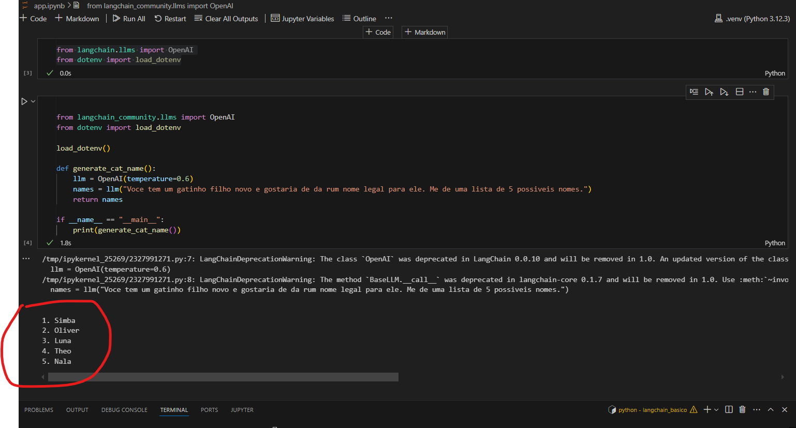
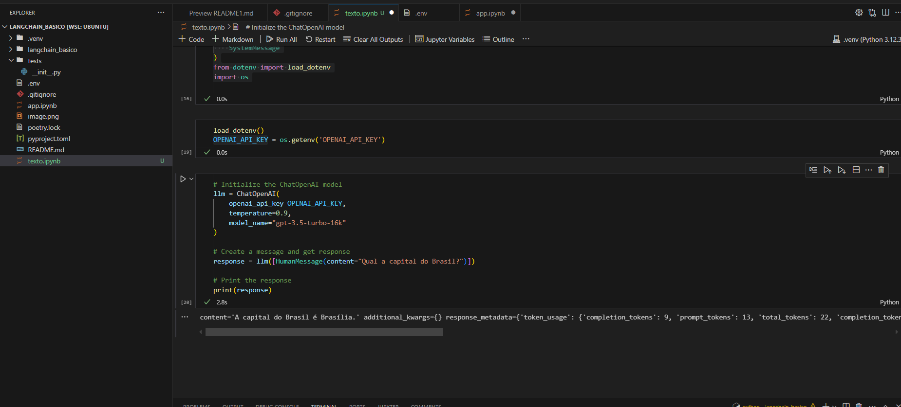

# Cat Name Generator

Generate creative cat names using LangChain and OpenAI.

## Project Structure
```
cat-name-generator/
├── src/
│   └── cat_name_generator/
│       └── main.py
├── tests/
│   └── test_generator.py
├── pyproject.toml
└── .env
```

## Requirements
- Python 3.12+
- Poetry

## Setup

1. Initialize project:
```bash
poetry init
```

2. Install dependencies:
```bash
poetry add langchain-community python-dotenv openai
poetry install
```

3. Configure OpenAI:
```bash
echo "OPENAI_API_KEY=your_key_here" > .env
```

## Usage

Run with Poetry:
```bash
poetry run python src/cat_name_generator/main.py
```

## Dependencies
```toml
[tool.poetry.dependencies]
python = "^3.12"
langchain-community = "^0.0.10"
python-dotenv = "^1.0.0"
openai = "^1.9.0"
```

## Testing
```bash
poetry run pytest
```

## Evidências




